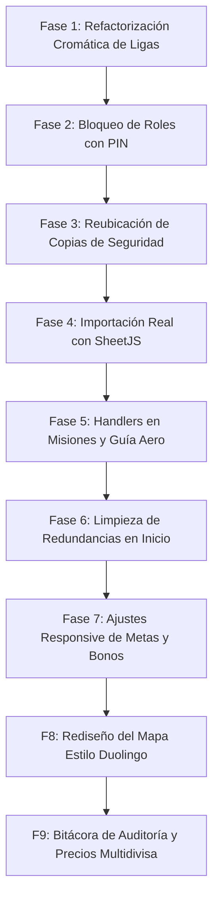

# Plan de Implementación Integral: Optimización Absoluta de DuoPOS

Este documento describe el plan de implementación técnica detallado para resolver **todas y cada una** de las fallas, inconsistencias contables, redundancias estéticas, carencias responsivas y mejoras del mapa interactivo identificadas en el archivo [correcciones.txt](file:///c:/xampp/htdocs/pos-duolingo/correcciones.txt) y el informe de auditoría [auditoria_sistema_duopos.md](file:///c:/xampp/htdocs/pos-duolingo/auditoria_sistema_duopos.md).

---

## 🛠️ Resumen de las 9 Fases del Plan de Implementación

El plan se estructurará en **9 fases secuenciales e independientes**, permitiendo una entrega continua y validable de forma robusta por el usuario:

---

## 📋 Detalle Técnico por Fase

### Fase 1: Refactorización Cromática de la Liga de Cajeros
* **Problema:** En el leaderboard semanal, las clases CSS rígidas colisionan con los temas oscuros comprados en la tienda, impidiendo la lectura de los datos.
* **Archivos Involucrados:**
  * [LeagueLeaderboard.tsx](file:///c:/xampp/htdocs/pos-duolingo/src/features/gamification/components/LeagueLeaderboard.tsx)
* **Solución Técnico-Estética:**
  * Leer el estado del tema del usuario en Zustand.
  * Reemplazar clases fijas (e.g. `bg-white`, `border-gray-250`, `text-[#3c3c3c]`) por clases adaptativas dinámicas (e.g. `bg-white dark:bg-gray-900 border-gray-250 dark:border-gray-800 text-gray-800 dark:text-gray-100`).
  * Aplicar opacidades adaptativas a los fondos de las filas de los participantes según el rango para conservar el degradado sin entorpecer el contraste del tema de color activo.

---

### Fase 2: Implementación de Seguridad y Bloqueo de Roles con PIN
* **Problema:** El selector superior de rol es libre y cualquiera puede ascenderse a Supervisor o Administrador en la terminal física sin restricciones.
* **Archivos Involucrados:**
  * [Header.tsx](file:///c:/xampp/htdocs/pos-duolingo/src/components/Layout/Header.tsx)
  * [useUserStore.ts](file:///c:/xampp/htdocs/pos-duolingo/src/stores/useUserStore.ts)
  * [NEW] [PinLockModal.tsx](file:///c:/xampp/htdocs/pos-duolingo/src/components/Modal/PinLockModal.tsx)
* **Solución Técnica:**
  * Crear un modal interactivo de confirmación por teclado numérico (`PinLockModal.tsx`).
  * Interceptar el cambio en el selector de roles de `Header.tsx`.
  * Si se intenta escalar privilegios (ej. *Cajero ➔ Administrador*), detener la acción y solicitar confirmación por PIN.
  * Validar contra los PINs de seguridad reales por defecto (`1234` para Supervisor, `1919` para Administrador).
  * Gatillar eventos de éxito con sonidos lúdicos o emitir una flash notification de rechazo en caso de error.

---

### Fase 3: Reubicación del Panel de Copia de Seguridad
* **Problema:** La utilidad de copia de seguridad está en la pestaña principal de Inicio, saturando visualmente el onboarding de facturación diaria del cajero.
* **Archivos Involucrados:**
  * [DashboardScreen.tsx](file:///c:/xampp/htdocs/pos-duolingo/src/features/dashboard/DashboardScreen.tsx)
  * [SettingsScreen.tsx](file:///c:/xampp/htdocs/pos-duolingo/src/features/settings/SettingsScreen.tsx)
* **Solución Técnica:**
  * Extraer las utilidades de exportación e importación JSON de `DashboardScreen.tsx`.
  * Diseñar una pestaña dedicada dentro de `SettingsScreen.tsx` titulada **"Base de Datos e Integridad"** o similar.
  * Reubicar el componente de forma estética con animaciones de carga fluidas al restaurar las bases de datos locales IndexedDB.

---

### Fase 4: Integración de Importación Real (Catálogo e Inventario / Clientes)
* **Problema:** Los botones de "Importar" en las pantallas de inventario y clientes son estáticos y no realizan ningún procesamiento de datos real.
* **Archivos Involucrados:**
  * [CustomersScreen.tsx](file:///c:/xampp/htdocs/pos-duolingo/src/features/customers/CustomersScreen.tsx)
  * [InventoryScreen.tsx](file:///c:/xampp/htdocs/pos-duolingo/src/features/inventory/InventoryScreen.tsx)
  * [NEW] [importService.ts](file:///c:/xampp/htdocs/pos-duolingo/src/services/importService.ts)
* **Solución Técnica:**
  * Desarrollar el servicio `importService.ts` utilizando la biblioteca `xlsx` (SheetJS) ya instalada en las dependencias del proyecto.
  * Programar validaciones de columnas (e.g. Código, Nombre, Precio Costo, Precio Venta para productos).
  * Diseñar botones clicables con un input tipo `file` oculto en las vistas.
  * Al subir un archivo Excel o CSV, parsearlo en caliente, verificar la validez e insertar masivamente en IndexedDB a través de Dexie de forma asíncrona.
  * Ofrecer descargas directas en la app de plantillas Excel estructuradas de ejemplo para el usuario.

---

### Fase 5: Activación de Handlers en Misiones y Guía Educativa de Aero
* **Problema:** Los botones "Aprender más" y "Ver todas" son estáticos (Dead Buttons).
* **Archivos Involucrados:**
  * [QuestsSection.tsx](file:///c:/xampp/htdocs/pos-duolingo/src/features/gamification/components/QuestsSection.tsx)
  * [NEW] [AeroGuideModal.tsx](file:///c:/xampp/htdocs/pos-duolingo/src/features/gamification/components/AeroGuideModal.tsx)
* **Solución Técnica:**
  * Programar un modal de inducción dinámico interactivo con ilustraciones animadas de Aero explicando el sistema de gamificación (XP, rachas, multipliers y ligas).
  * Conectar el handler de "Aprender más" para que despliegue el modal educativo.
  * Habilitar el handler "Ver todas" para que alterne de forma fluida hacia la vista de trofeos y la tienda del club.

---

### Fase 6: Eliminación de Redundancias Estéticas en el Inicio
* **Problema:** Widgets redundantes en el Dashboard. La tarjeta del cajero activo duplica el nivel y la racha que ya se exponen en la cabecera del sistema. El avatar del mentor Aero duplica recursos visuales.
* **Archivos Involucrados:**
  * [DashboardScreen.tsx](file:///c:/xampp/htdocs/pos-duolingo/src/features/dashboard/DashboardScreen.tsx)
  * Componentes de widgets en el Dashboard.
* **Solución Técnica:**
  * Rediseñar la tarjeta de perfil del cajero en el inicio para enfocarla en estadísticas útiles de su turno activo (ventas concretadas hoy, XP acumulada en las últimas horas) en lugar de redundar con el nivel y racha global.
  * Ajustar el recurso de imagen o animación de "Aero" para diferenciarlo estéticamente del avatar del búho del cajero, dándole un estilo de "asistente financiero virtual premium".

---

### Fase 7: Correcciones de Diseño Responsive en Metas y Bonos Grupales
* **Problema:** Los widgets de "Ajustar meta del día" y "Bono grupal de sucursal" sufren problemas severos de solapamiento de textos e inputs en pantallas móviles o medianas.
* **Archivos Involucrados:**
  * [DashboardScreen.tsx](file:///c:/xampp/htdocs/pos-duolingo/src/features/dashboard/DashboardScreen.tsx) y componentes de widgets.
* **Solución Técnica:**
  * Refactorizar las grillas Flexbox y CSS Grid de estos dos widgets utilizando layouts responsivos móviles y clases flexibles de Tailwind (e.g. `grid-cols-1 md:grid-cols-2 lg:grid-cols-3` y paddings proporcionales).
  * Garantizar la legibilidad de las etiquetas y campos de entrada en temas oscuros mediante la correcta herencia cromática del fondo de la aplicación.

---

### Fase 8: Rediseño del Mapa de Progreso (SagaMap) al Estilo Duolingo
* **Problema:** El mapa actual interactivo del camino de capacitación de cajeros es muy plano, lineal y rígido en bloques rectos. Carece del aspecto orgánico y curvo tridimensional de Duolingo.
* **Archivos Involucrados:**
  * [SagaMap.tsx](file:///c:/xampp/htdocs/pos-duolingo/src/features/gamification/components/SagaMap.tsx)
* **Solución Técnica:**
  * Modificar el renderizado SVG para trazar una **curva de progresión sinoidal orgánica** de tipo serpentina.
  * Aplicar micro-animaciones fluidas (rebotes, destellos) a los nodos interactivos.
  * Dibujar los iconos y avatares flotando a los costados del camino con sombras difuminadas para dar una sensación visual premium tridimensional de profundidad 2.5D.
  * Diseñar marcadores interactivos fluidos que indiquen la ubicación del cajero actual en el mapa de forma lúdica.

---

### Fase 9: Bitácora de Auditoría Administrativa General y Precios Multidivisa en Catálogo
* **Problema:** No existe un registro centralizado de cambios (auditoría de secciones como catálogo, edición de clientes, etc.) y la tarjeta del catálogo solo expone los precios en USD, obviando la visualización en Bolívares (tasa BCV).
* **Archivos Involucrados:**
  * [InventoryScreen.tsx](file:///c:/xampp/htdocs/pos-duolingo/src/features/inventory/InventoryScreen.tsx)
  * [HistoryScreen.tsx](file:///c:/xampp/htdocs/pos-duolingo/src/features/history/HistoryScreen.tsx)
  * [db.ts](file:///c:/xampp/htdocs/pos-duolingo/src/services/db.ts)
  * [useInventoryStore.ts](file:///c:/xampp/htdocs/pos-duolingo/src/stores/useInventoryStore.ts)
* **Solución Técnica:**
  * **Bitácora de Auditoría:**
    1. Registrar una nueva clave de almacenamiento en el Dexie (IndexedDB) para logs administrativos (`audit_logs`).
    2. Crear hooks que capturen cambios críticos del sistema: edición de precios del catálogo, alteraciones de datos de clientes, transiciones de configuraciones e IVA.
    3. Añadir una pestaña llamada **"Auditoría Administrativa"** en la pantalla de Historial, que dibuje un listado detallado (fecha, usuario, módulo, acción, valores antes/después) con exportación a Excel.
  * **Precios Multidivisa en Catálogo:**
    1. Refactorizar las tarjetas de inventario en `InventoryScreen.tsx` para dibujar de manera destacada el precio en USD base y, a su lado o debajo con una tipografía contrastante secundaria, el cálculo en vivo equivalente en Bolívares (VES) de acuerdo a la tasa cambiaria del BCV cargada en el store.
    2. Asegurar que las variaciones de la tasa se propaguen de inmediato en vivo a las tarjetas de productos sin necesidad de refrescar la pantalla.

---

## 🧪 Plan de Verificación y Control de Calidad

Cada una de las fases descritas será sometida a pruebas estrictas de compilación, respuesta de interfaz (60fps) e integridad de datos:
1. **Verificación Cromática y Contraste:** Comprobar la correcta legibilidad de la clasificación en modo claro y en modo oscuro (Retro 8-bit y Galaxy).
2. **Pruebas de Bloqueo de Roles:** Validar que sea imposible acceder a paneles de supervisor/administrador sin suministrar el PIN correcto, y verificar que no haya fugas de estado reactivo en Zustand.
3. **Validación de Parseo de Archivos:** Cargar archivos Excel con estructuras válidas y dañadas para asegurar que el sistema capture y notifique excepciones sin colapsar la base de datos local.
4. **Fidelidad del Camino / SagaMap:** Evaluar la fluidez de desplazamiento y la interactividad de la curva SVG en dispositivos móviles.
5. **Auditoría e Integridad Financiera:** Crear cambios en productos y validar que la pestaña de auditoría registre el evento de manera exacta.

---

## 🙋 Decisiones de Diseño y Preguntas Abiertas

> [!NOTE]  
> **Preguntas de Confirmación:**
> 1. **¿Qué PIN numérico deseas asignar a Supervisor y Administrador?** *(Por defecto configuraré `1234` y `1919`, pero dime si prefieres otros).*
> 2. **¿Estás de acuerdo con añadir las plantillas de Excel (.xlsx) listas para descargar en los modales de importación?** *(Esto evitará que subas formatos incorrectos y es muy profesional).*
